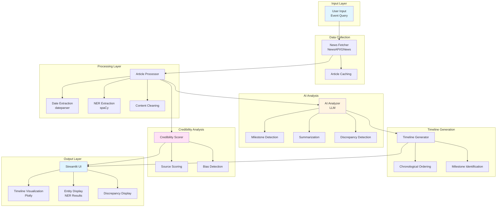

# AI News Orchestrator 📰

An AI-powered system that aggregates, verifies, and summarizes multiple news sources into a single, cohesive event timeline. Reconstruct the story from information overload.

## 🎯 Purpose

The internet is flooded with news - the same story covered by dozens of outlets, each with slightly different tones, facts, or focus. While readers often see individual articles, they rarely get to see the full evolution of a story - when it began, what key events followed, and how it progressed over time.

This system helps you:
- **Aggregate** news from multiple sources
- **Verify** information and detect discrepancies
- **Summarize** events into coherent timelines
- **Score** source credibility and authenticity

## ✨ Features

### Core Functionality

- **News Aggregation**: Fetches articles from NewsAPI and GNews
- **Chronological Timeline**: Automatically orders events by date
- **AI-Powered Analysis**: Uses GPT-4/GPT-3.5 or Gemini for intelligent summarization
- **Milestone Detection**: Identifies major turning points in events
- **Source Credibility Scoring**: Evaluates authenticity of sources and articles
- **Discrepancy Detection**: Flags conflicting information between sources
- **Interactive Visualization**: Beautiful timeline charts with Plotly

### Bonus Features

- **Bias Detection**: Identifies clickbait and subjective content
- **Verified Facts**: Highlights information confirmed by multiple sources
- **Export Options**: Download results as JSON or text
- **Caching**: Saves articles for offline demo mode

## 🚀 Quick Start

### Prerequisites

- Python 3.8 or higher
- API keys (see Configuration section)

### Installation

1. **Clone or download this repository**

2. **Install dependencies**:
```bash
pip install -r requirements.txt
```

3. **Install spaCy language model**:
```bash
python -m spacy download en_core_web_sm
```

4. **Set up API keys**:
   - Copy `.env.example` to `.env`
   - Add your API keys (see Configuration section)

5. **Run the application**:
```bash
streamlit run app.py
```

The application will open in your browser at `http://localhost:8501`

## ⚙️ Configuration

### Required API Keys

#### NewsAPI (Primary)
1. Sign up at [https://newsapi.org/register](https://newsapi.org/register)
2. Get your free API key (100 requests/day)
3. Add to `.env`: `NEWSAPI_KEY=your_key_here`

#### LLM Provider (Choose one)

**OpenAI (Recommended)**
1. Get API key from [https://platform.openai.com/api-keys](https://platform.openai.com/api-keys)
2. Add to `.env`: `OPENAI_API_KEY=your_key_here`
3. Set: `LLM_PROVIDER=openai`

**Google Gemini (Alternative)**
1. Get API key from [https://makersuite.google.com/app/apikey](https://makersuite.google.com/app/apikey)
2. Add to `.env`: `GEMINI_API_KEY=your_key_here`
3. Set: `LLM_PROVIDER=gemini`

### Environment Variables

Create a `.env` file with:

```env
# News API
NEWSAPI_KEY=your_newsapi_key_here

# LLM Configuration
OPENAI_API_KEY=your_openai_key_here
# OR
GEMINI_API_KEY=your_gemini_key_here
LLM_PROVIDER=openai  # or "gemini"
OPENAI_MODEL=gpt-3.5-turbo  # or "gpt-4"

# Optional Settings
MAX_ARTICLES=10
NEWSAPI_LANGUAGE=en
CACHE_ARTICLES=true
```

## 📖 Usage

1. **Enter Event Query**: Type an event title or keyword (e.g., "Chandrayaan-3 Mission", "OpenAI GPT-5 Launch")

2. **Click Analyze**: The system will:
   - Fetch articles from multiple sources
   - Process and extract dates/entities
   - Analyze with AI
   - Generate timeline
   - Score credibility

3. **View Results**:
   - **Timeline Visualization**: Interactive chart showing event progression
   - **Event Summary**: AI-generated overview
   - **Key Highlights**: Important facts and milestones
   - **Verified Facts**: Information confirmed by multiple sources
   - **Source Discrepancies**: Conflicting information flagged
   - **Credibility Scores**: Authenticity ratings for each source

4. **Export**: Download results as JSON or timeline text

## 🏗️ Architecture

### System Flow

```
User Input (Event Query)
    ↓
News Fetcher (NewsAPI/GNews)
    ↓
Article Processor (Date Extraction, NER)
    ↓
AI Analyzer (LLM: Milestone Detection, Summarization)
    ↓
Timeline Generator (Chronological Ordering)
    ↓
Credibility Scorer (Source Authenticity)
    ↓
Streamlit UI (Visualization & Display)
```

### Module Structure

- **`news_fetcher.py`**: Fetches articles from NewsAPI and GNews
- **`article_processor.py`**: Extracts dates, entities, and cleans content
- **`ai_analyzer.py`**: LLM-based analysis for milestones and summarization
- **`timeline_generator.py`**: Orders events chronologically
- **`credibility_scorer.py`**: Scores source and article credibility
- **`app.py`**: Streamlit UI application
- **`config.py`**: Configuration and API key management
- **`utils.py`**: Helper functions

### System Architecture Diagram



## 🔧 Technical Stack

- **Frontend**: Streamlit
- **News APIs**: NewsAPI, GNews
- **LLM**: OpenAI GPT-3.5/GPT-4 or Google Gemini
- **NLP**: spaCy (NER), dateparser
- **Visualization**: Plotly
- **Data Processing**: pandas, BeautifulSoup
- **Caching**: JSON files

## 📊 Example Output

### Input
```
Event: "Chandrayaan-3 Mission"
```

### Output
- **Timeline**: 
  - 2023-07-14 → Mission launch announced
  - 2023-07-22 → Vehicle lifted off successfully
  - 2023-08-23 → Lander achieved soft landing

- **Summary**: Comprehensive 2-3 paragraph overview of the mission

- **Key Highlights**: 
  - First successful soft landing on Moon's south pole
  - Mission duration and objectives
  - Scientific instruments deployed

- **Credibility Score**: Average authenticity across sources

## 🎯 Judging Focus

> "Your AI shouldn't just summarize the news - it should reconstruct the story."

The system demonstrates:
- **Intelligent Analysis**: Not just aggregation, but understanding
- **Chronological Reconstruction**: How events evolved over time
- **Source Verification**: Authenticity and credibility assessment
- **Discrepancy Detection**: Identifying conflicting information
- **Clear Visualization**: Easy-to-understand timeline presentation

## 🐛 Troubleshooting

### No Articles Found
- Check your NewsAPI key is valid
- Try a different search term
- Check internet connection
- Verify API rate limits haven't been exceeded

### LLM Analysis Not Working
- Verify API key is set correctly
- Check API quota/credits
- Try switching LLM provider (OpenAI ↔ Gemini)
- System will fall back to basic analysis if LLM fails

### spaCy Model Error
```bash
python -m spacy download en_core_web_sm
```

### Import Errors
```bash
pip install -r requirements.txt
```

## 📝 Deliverables

- ✅ Working prototype with UI
- ✅ News fetching from multiple sources
- ✅ Chronological timeline generation
- ✅ Event summarization
- ✅ Source credibility scoring
- ✅ Clean visualization
- ✅ Complete documentation
- 📹 Demo video (to be created)
- 📊 Sample dataset (optional)

## 🔮 Future Enhancements

- Multi-language support
- Real-time event tracking
- Advanced bias detection with ML models
- Fact-checking integration
- PDF export with formatted reports
- Database storage for historical analysis

## 📄 License

This project is created for Vibethon competition.

## 👥 Credits

Built for Vibethon - AI News Orchestrator Challenge

---

**Note**: This system requires API keys for full functionality. Free tiers are available for NewsAPI and OpenAI/Gemini for testing purposes.

